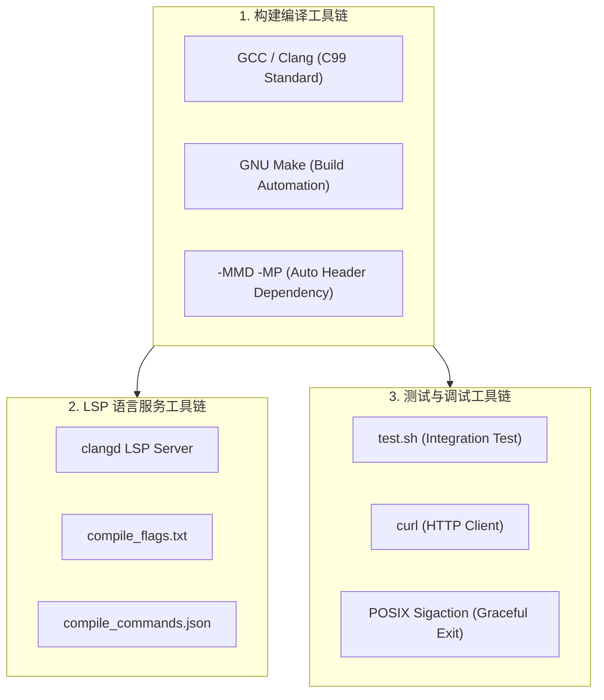

# Chaos-Proxy 工具链与第三方依赖说明文档

**工程名称**：Chaos-Proxy (混沌代理)  
**文档版本**：V1.0  
**编写时间**：2026-07-30  
**关联文档**：
- [产品需求文档 (PRD)](file:///Users/didi/Desktop/my-project/chaos-proxy/docs/%E4%BA%A7%E5%93%81%E6%96%87%E6%A1%A3.md)
- [架构与技术方案](file:///Users/didi/Desktop/my-project/chaos-proxy/docs/%E6%9E%B6%E6%9E%84%E4%B8%8E%E6%8A%80%E6%9C%AF%E6%96%B9%E6%A1%88.md)
- [C语言工程化最佳实践指南](file:///Users/didi/Desktop/my-project/chaos-proxy/docs/C%E8%AF%AD%E8%A8%80%E5%B7%A5%E7%A8%8B%E5%8C%96%E6%9C%80%E4%BD%B3%E5%AE%9E%E8%B7%B5%E6%8C%87%E5%8D%97.md)

---

## 1. 工具链体系 (Toolchain Overview)

项目的开发与构建工具链遵循**现代 C 语言工程化**最佳实践，主要由以下四部分构成：



### 1.1 构建编译工具链 (Build Toolchain)

| 工具 / 选项 | 类型 | 描述与配置作用 |
| :--- | :--- | :--- |
| **GNU Make** | 构建系统 | 管理编译流程。在根目录 [Makefile](file:///Users/didi/Desktop/my-project/chaos-proxy/Makefile) 中定义 `all`, `debug`, `test`, `clean` 目标。 |
| **GCC / Clang** | C 编译器 | 项目主编译器，严格遵循 **POSIX C99 (-std=c99)** 标准。 |
| **`-MMD -MP`** | 依赖自动分析 | 编译器自动分析头文件依赖并生成 `.d` 文件，确保修改 `.h` 后增量编译精准触发。 |
| **`-Wall -Wextra -Werror`** | 质量防线 | 严格警告检查，将所有潜在警告转为错误，确保代码 0 警告。 |
| **`-O2`** | 性能优化 | 开启编译器标准优化，提升 Reactor 轮询与 HTTP 检索性能。 |

---

### 1.2 编辑器与 LSP 语言服务工具链 (IDE Toolchain)

项目针对 **Zed**、VS Code、CLion 等现代编辑器配置了完整的 C/C++ 语言服务器（LSP）数据库：

| 配置文件 | 作用与机制 |
| :--- | :--- |
| **`clangd`** | Zed 及绝大多数现代编辑器默认内置的 LLVM 官方 C/C++ 高级语言服务器。 |
| **[compile_flags.txt](file:///Users/didi/Desktop/my-project/chaos-proxy/compile_flags.txt)** | 告知 `clangd` 增加 `-Iinclude` 包含路径，解决 Zed 中 `'common.h' file not found` 提示。 |
| **[.clangd](file:///Users/didi/Desktop/my-project/chaos-proxy/.clangd)** | `clangd` 专属项目级配置文件。 |
| **[compile_commands.json](file:///Users/didi/Desktop/my-project/chaos-proxy/compile_commands.json)** | C/C++ 工业标准编译指令数据库，记录所有源文件的编译参数，支持高精度的符号自动补全与跳转。 |

---

### 1.3 测试与调试工具链 (Test & Debug Toolchain)

| 工具 / 文件 | 作用说明 |
| :--- | :--- |
| **[test.sh](file:///Users/didi/Desktop/my-project/chaos-proxy/test.sh)** | 自动化功能集成测试脚本，集成构建校验、后台服务挂载、HTTP 请求响应匹配与耗时校验。 |
| **`curl`** | 命令行 HTTP 模拟工具，用于发送带有 Header/Method 的测试请求。 |
| **`sigaction`** | POSIX 信号处理机制，在捕获 Ctrl+C 时输出运行统计摘要并安全清理 Socket。 |

---

## 2. 第三方依赖说明 (Third-party Dependencies)

### 2.1 “零外部动态库” 设计原则 (Zero External Dependencies)

Chaos-Proxy 的设计哲学是**极致轻量、零侵入与零配置**：

- ❌ **不需要** `npm` / `node_modules`
- ❌ **不需要** `pip` / Python 解释器环境
- ❌ **不需要** 安装 `boost` / `libcurl` / `glib` 等重型 C/C++ 动态链接库

编译产物为一个独立的单文件二进制二进制文件（`< 5MB`），解压即用。

### 2.2 内置轻量开源库 (In-tree Embedded Dependency)

| 依赖名称 | 所在路径 | 作用与集成方式 |
| :--- | :--- | :--- |
| **`cJSON`** | [include/cJSON.h](file:///Users/didi/Desktop/my-project/chaos-proxy/include/cJSON.h)<br/>[src/cJSON.c](file:///Users/didi/Desktop/my-project/chaos-proxy/src/cJSON.c) | 全世界最轻量的 ANSI C JSON 解析库。采用**源码级内嵌 (In-tree Source Inclusion)** 方式直接参与编译，用于解析 `rules.json` 规则文件。 |

---

## 3. 操作系统标准库依赖 (System Libraries)

程序仅依赖 Linux / macOS 操作系统内核原生的 POSIX 标准库 (`libc`)：

```text
chaos-proxy (可执行二进制)
 ├── libc (提供 socket, bind, listen, accept, read, write, select, fcntl 等基础调用)
 └── libm (-lm 动态链接，提供 pow 等数学计算，供 cJSON 数值转换使用)
```

---
