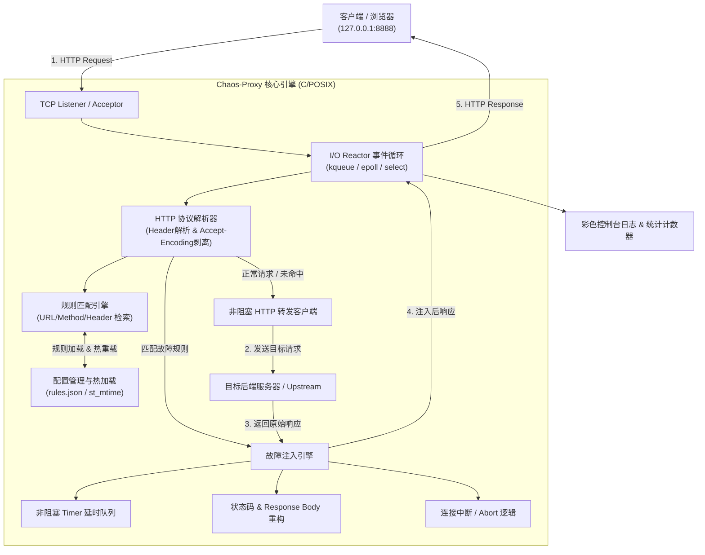
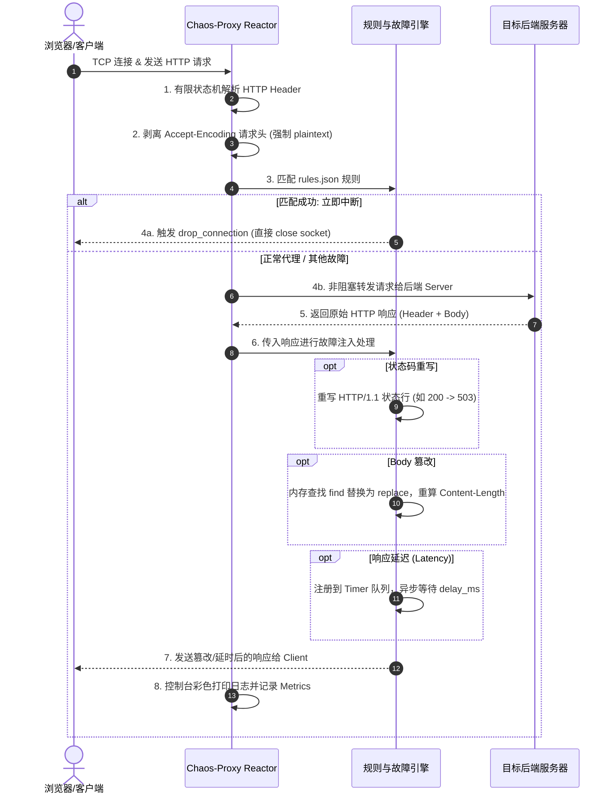

# Chaos-Proxy 架构与技术方案设计书

**项目名称**：Chaos-Proxy（混沌代理）  
**文档版本**：V1.0 Architecture & Technical Design  
**编写时间**：2026-07-30  
**关联文档**：[产品需求文档 (PRD)](file:///Users/didi/Desktop/my-project/chaos-proxy/docs/%E4%BA%A7%E5%93%81%E6%96%87%E6%A1%A3.md)

---

## 1. 架构设计目标与原则

根据产品需求文档（PRD V1.0），Chaos-Proxy 的定位是一个**零侵入、零配置、高吞吐、低消耗**的本地 HTTP 故障注入代理。技术方案的设计遵循以下核心原则：

1. **极致轻量与零依赖**：采用 POSIX C99 标准开发，代码自包含，编译后单一二进制可执行文件（< 5MB），内存占用 < 20MB。
2. **事件驱动高并发**：采用单线程 **Reactor 事件循环** 结合非阻塞 Socket I/O（`kqueue` / `epoll` / `select`），轻松支持 100+ 并发连接，单核 CPU 占用 < 5%。
3. **非阻塞故障注入**：延迟注入不使用阻塞式的 `sleep`，而是通过 Reactor 的定时器队列实现异步延时触发，确保单个连接的延迟不阻塞其他并发请求。
4. **强可维护性与模块解耦**：按照网络事件、HTTP 解析、规则匹配、故障注入、日志监控拆分为独立的无状态/低耦合 C 模块。

---

## 2. 系统整体架构设计

### 2.1 整体分层架构图



### 2.2 数据生命周期与处理流程



---

## 3. 核心模块与详细技术设计

### 3.1 模块与目录规划

```text
chaos-proxy/
├── docs/
│   ├── 产品文档.md
│   └── 架构与技术方案.md
├── include/
│   ├── common.h         # 公共宏定义、数据结构、日志级别
│   ├── event_loop.h     # Reactor 事件循环抽象 (kqueue/epoll/select)
│   ├── http_parser.h    # HTTP 协议解析与 Header 过滤
│   ├── rule_engine.h    # 规则解析、匹配与文件热重载
│   ├── chaos_engine.h   # 故障注入（延迟、状态码改写、Body 替换、断连）
│   ├── cJSON.h          # 轻量级 JSON 解析组件
│   └── logger.h         # ANSI 彩色控制台日志与统计汇总
├── src/
│   ├── main.c           # CLI 参数解析、信号捕获、程序主入口
│   ├── event_loop.c     # Reactor 多路复用具体实现
│   ├── http_parser.c    # HTTP 协议状态机解析实现
│   ├── rule_engine.c    # JSON 规则匹配算法与文件监控
│   ├── chaos_engine.c   # 故障注入核心算法实现
│   ├── cJSON.c          # cJSON 库实现
│   └── logger.c         # 日志格式化输出与终端统计报告
├── rules.json           # 示例配置文件
└── Makefile             # C 语言编译构建自动化脚本
```

---

### 3.2 关键模块设计细节

#### 1. Reactor 事件循环与连接状态机 (`event_loop.h` / `event_loop.c`)

为保证在 macOS 和 Linux 上均达到最优性能，使用条件编译抽象底层的 多路复用 接口：
- **macOS / BSD**：优先使用 `kqueue`
- **Linux**：优先使用 `epoll`
- **通用降级**：支持 `select`

每个 TCP 连接被抽象为一个 `conn_t` 结构体，维护双向传输状态：

```c
typedef enum {
    CONN_STATE_READ_CLIENT_REQ,    // 正在接收客户端请求 Header/Body
    CONN_STATE_PARSE_REQ,          // 解析请求 & 匹配规则
    CONN_STATE_CONNECT_UPSTREAM,   // 非阻塞连接目标服务器
    CONN_STATE_WRITE_UPSTREAM,     // 转发请求至目标服务器
    CONN_STATE_READ_UPSTREAM,      // 接收目标服务器响应 Header/Body
    CONN_STATE_INJECT_CHAOS,       // 执行故障注入 (修改 Body/Code)
    CONN_STATE_DELAY_WAIT,         // 定时器就绪等待 (延时发送)
    CONN_STATE_WRITE_CLIENT,       // 发送最终响应给客户端
    CONN_STATE_CLOSED              // 连接准备销毁
} conn_state_t;

typedef struct conn {
    int client_fd;
    int upstream_fd;
    conn_state_t state;
    
    // 缓冲区
    char req_buf[8192];
    size_t req_len;
    char resp_buf[65536];
    size_t resp_len;
    
    // HTTP 元信息
    char method[16];
    char path[1024];
    char host[256];
    int port;
    
    // 匹配到的规则句柄
    struct rule_t *matched_rule;
    
    // 延时发送控制
    uint64_t send_after_ms;        // 允许发送的时间戳
    struct conn *next;
} conn_t;
```

#### 2. HTTP 协议解析与解压处理 (`http_parser.h` / `http_parser.c`)

- **零拷贝 Header 解析**：查找 `\r\n\r\n` 划分 Header 与 Body；从 `Host:` 字段获取目标服务器地址与端口（默认为 80）。
- **`Accept-Encoding` 剥离**：在转发客户端请求给 Upstream 之前，扫描 Header 并自动移除 `Accept-Encoding: gzip, deflate, br` 行或替换为 `Accept-Encoding: identity`。
  - *设计用意*：避免上游返回压缩数据，确保响应体能够以明文形式进行字符串匹配与替换（Body Manipulation）。

#### 3. 规则匹配与文件热重载 (`rule_engine.h` / `rule_engine.c`)

- **规则结构体**：
```c
typedef struct rule_t {
    char name[128];
    int enabled;
    
    // 匹配条件
    char match_url[512];
    char match_method[16];
    
    // 故障注入参数
    int delay_ms;
    int status_code;
    char find_str[256];
    char replace_str[512];
    int close_immediately;
    
    struct rule_t *next;
} rule_t;
```
- **文件热重载 (Hot Reload)**：
  - 在 Reactor 的每次 loop 间隙中（如每 1s），通过 `stat(config_path, &st)` 检查 `st_mtime`。
  - 一旦发现修改时间发生变更，立即重新解析 `rules.json` 并使用**双缓冲/指针原子交换**机制更新内存中的规则链表，无需中断代理服务。

#### 4. 故障注入引擎 (`chaos_engine.h` / `chaos_engine.c`)

1. **响应延时 (Latency Injection)**：
   - 触发延时时不使用 `sleep()`/`usleep()`。
   - 将 `conn->send_after_ms` 设置为 `get_current_time_ms() + rule->delay_ms`。
   - 连接状态转为 `CONN_STATE_DELAY_WAIT`，取消客户端 Socket 的 `WRITE` 事件关注。
   - 在 Event Loop 的定时器检查逻辑中，当 `now >= conn->send_after_ms` 时重新唤醒连接并注册 `WRITE` 事件，将数据发回客户端。
2. **状态码篡改 (Status Code Override)**：
   - 匹配响应头部第一行 `HTTP/1.1 200 OK\r\n`。
   - 用规则中的 `status_code` 重新格式化状态行（如 `HTTP/1.1 503 Service Unavailable\r\n`），保留后续 Header 及 Body。
3. **响应体篡改 (Body Manipulation)**：
   - 搜索 `resp_buf` 中的 `find_str`。
   - 若命中，计算新 Body 长度，将 `find_str` 替换为 `replace_str`。
   - 重新计算并替换 Header 中的 `Content-Length: <new_size>`。
4. **连接中断 (Connection Drop)**：
   - 若配置了 `close_immediately`，在接收到请求后立即对 `client_fd` 执行 `close()`，不发送任何响应数据，精确模拟网络闪断/RST 异常。

#### 5. 控制台日志与运行监控 (`logger.h` / `logger.c`)

- ANSI 颜色输出格式化：
  - 正常转发：`[200 OK] GET /api/user/profile -> 25ms` (绿色)
  - 故障注入：`[503 INJECTED] POST /api/user/login (Rule: 模拟登录系统繁忙, Delay: 2000ms)` (红色/黄色)
- 退出统计摘要：
  - 捕获 `SIGINT` (Ctrl+C) 信号，优雅打印统计报表：
```text
==================================================
              Chaos-Proxy 运行统计摘要             
==================================================
总请求数:       1,420
成功转发:       1,200
故障注入总数:   220
  - 延时注入:   150
  - 状态码改写: 50
  - Body 篡改:  15
  - 连接中断:   5
==================================================
```

---

## 4. 非功能性指标落地与保障方案

| 指标维度 | PRD 目标 | 技术保障设计方案 |
| :--- | :--- | :--- |
| **内存开销** | < 20MB | 静态环形 Buffer + 零动态分配池；连接关闭时即刻回收 `conn_t`；限制单 HTTP Header 缓冲区最高 8KB。 |
| **二进制体积** | < 5MB | 使用原生 POSIX C 编译；移除无用符号 (`-s` / `-O2`)；仅集成单文件 `cJSON` 库，无其他重型外部依赖。 |
| **CPU 占用** | < 5% (单核) | 基于 OS 内核多路复用（`kqueue`/`epoll`），无忙等待 (Busy Loop)；事件等待精确阻塞到下一个定时器到期时刻。 |
| **转发时延** | < 5ms (正常请求) | 内存零拷贝指针偏移解析，匹配算法算法复杂度近乎 O(N_rules)，规则量级在 100 以内耗时 < 0.1ms。 |
| **跨平台** | macOS / Linux | 条件编译区别处理 Socket 选项（如 `SO_REUSEADDR` / `NOSIGPIPE`）与多路复用系统调用。 |

---

## 5. 项目路线图与未来演进 (V2.0/V3.0 设计预留)

1. **V2.0 HTTPS (MITM) 扩展支持**：
   - 架构预留：在 `conn_t` 中预留 `ssl_ctx` 指针。未来引入轻量级 TLS 库（如 `mbedtls`），实现 TLS 握手与动态根证书签发。
2. **V2.0 嵌 Web UI 界面**：
   - 架构预留：在 Proxy 中挂载 `/chaos/ui` 内部路由，直接基于内嵌 HTML/CSS/JS 静态字符串提供可视化配置页面，调用内置 REST API 增删改查规则。

---
