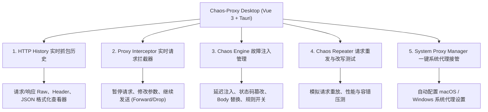

# Chaos-Proxy 桌面客户端设计方案 (对标 Burp Suite)

**项目名称**：Chaos-Proxy Desktop  
**产品定位**：跨平台可视化 HTTP(S) 抓包代理、请求重放与故障注入桌面应用（对标 Burp Suite / Charles / Fiddler）  
**前端技术栈**：**Vue 3 (Composition API) + Vite + Naive UI / TailwindCSS**  
**桌面应用框架**：**Tauri (Rust + Webview) 或 Electron**  
**编写时间**：2026-07-30  

---

## 1. 核心功能模块设计 (对标 Burp Suite)



### 1.1 五大核心功能版块

1. **HTTP History (抓包历史视窗)**
   - 实时流式列出所有拦截到的请求（包含 ID, Method, Host, Path, Status, Response Time, Size）。
   - 双栏/上下分栏视窗：点击任意一行，展示原汁原味的 **Request Headers / Body** 与 **Response Headers / Body**。
   - 提供 JSON 树状展开与 Pretty 打印。
2. **Proxy Interceptor (实时拦截与挂起)**
   - 包含 **Intercept is ON / OFF** 顶部大开关。
   - 当开关开启时，发出的 HTTP 请求会在桌面客户端中暂停挂起，开发人员可手动修改 Header/Body 参数后点击 **[Forward (继续发送)]** 或 **[Drop (丢弃请求)]**。
3. **Chaos Rules (故障注入引擎规则库)**
   - Vue 3 响应式规则卡片列表。
   - 参数滑动调节：延时滑块 (0 ~ 10,000ms)、状态码重写下拉框 (503 / 500 / 429 等)、Body 查找替换、瞬间断连。
4. **Repeater (请求重放测试器)**
   - 对标 Burp Suite 的 Repeater。在 HTTP History 中右键“Send to Repeater”，可以在独立的测试面板中反复修改 Request 参数并重新发送，实时观测后端或故障代理的反馈。
5. **System Proxy Manager (系统代理一键接管)**
   - 桌面应用顶部提供 **[开启系统代理]** 按钮，点击后自动调用 OS 系统 API 将系统代理指向 `127.0.0.1:8888`，关闭软件时自动恢复，再也不需要手动去系统设置配置。

---

## 2. 桌面客户端技术选型 (Vue 3 + Tauri)

为了既满足您**“平时用 Vue 3 开发”**的习惯，又拥有专业的桌面级性能，最理想的架构为 **Tauri + Vue 3**：

```text
chaos-proxy/
├── docs/
│   ├── 产品文档.md
│   └── 桌面客户端设计方案.md      # 👈 本方案设计书
├── desktop/                      # 👈 Vue 3 桌面应用客户端
│   ├── package.json              # Vue 3 + Vite 依赖
│   ├── src-tauri/                # Tauri 原生桌面系统调用 (Rust)
│   │   ├── tauri.conf.json       # 桌面窗口尺寸、图标配置
│   │   └── src/main.rs           # 原生 Socket 代理与系统代理切换
│   └── src/                      # 前端 Vue 3 全量工程
│       ├── App.vue               # 主应用布局
│       ├── views/
│       │   ├── HistoryView.vue   # 抓包历史列表 (对标 Burp History)
│       │   ├── Interceptor.vue   # 实时拦截与挂起 (对标 Burp Interceptor)
│       │   ├── ChaosRules.vue    # 故障规则配置
│       │   └── Repeater.vue      # 请求重载测试
│       └── components/
│           ├── RequestViewer.vue # 请求分栏查看器 (Headers/Body/JSON)
│           └── ResponseViewer.vue
```

---

## 3. UI 界面布局蓝图 (对标 Burp Suite)

```text
+---------------------------------------------------------------------------------------------------------+
| ⚡ Chaos-Proxy Desktop v1.0                     [ 🌐 系统代理: 已开启 ]  [ ⚡ 拦截器: ON ] [⚙ 设置] |
+---------------------------------------------------------------------------------------------------------+
| [ 📜 抓包历史 (History) ]  [ 🛑 实时拦截 (Interceptor) ]  [ 💥 故障规则 (Chaos Rules) ]  [ 🔄 重发器 (Repeater) ] |
+---------------------------------------------------------------------------------------------------------+
| #   | Method | Host               | Path              | Status | Delay  | Size   | Time                 |
| 1   | POST   | api.github.com     | /api/user/login   | 503 💥 | 2000ms | 1.2 KB | 15:30:12             |
| 2   | GET    | example.com        | /api/order/list   | 200    | 3000ms | 4.8 KB | 15:30:15             |
| 3   | GET    | api.github.com     | /api/ping         | 200    | 12ms   | 310 B  | 15:30:18             |
+---------------------------------------------------------------------------------------------------------+
| [ Request 报文分栏查看器 ]                            | [ Response 响应分栏查看器 ]                        |
| Header | Raw | JSON                                   | Header | Raw | JSON | Mod Summary               |
| ----------------------------------------------------- | ----------------------------------------------- |
| POST /api/user/login HTTP/1.1                         | HTTP/1.1 503 Service Unavailable (Injected 💥) |
| Host: api.github.com                                  | Content-Type: application/json                 |
| Content-Type: application/json                        | Content-Length: 27                              |
|                                                       |                                                 |
| { "user": "admin", "pass": "****" }                   | { "code": 5, "msg": "chaos ok" }                 |
+---------------------------------------------------------------------------------------------------------+
```

---

## 4. 演进步骤规划

1. **第一阶段 (桌面前端原型)**：在 `desktop/` 搭建基于 **Vue 3 + Vite + Naive UI** 的专业分栏面板与响应式状态。
2. **第二阶段 (代理引擎与后端通信)**：通过 WebSocket / IPC 将后台 HTTP 连接实时推送给前端 Vue 3 History 视图。
3. **第三阶段 (一键接管系统代理)**：集成原生系统代理脚本 (macOS `networksetup` / Windows Registry)，实现点按钮即接管系统网络。

---
